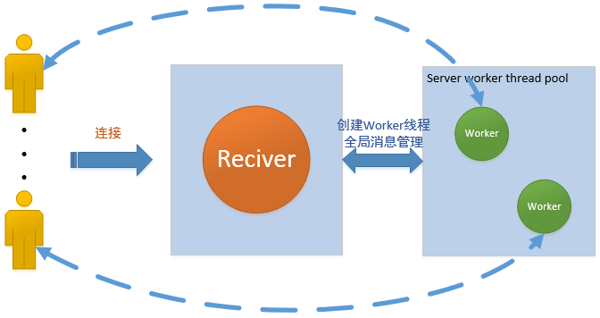

# 基于Socket的聊天室应用

## 说明  
由socket多线程tcp连接支持的CS架构聊天室

*使用了IDEA FORM GUI帮助搭建Swing窗体*
*多线程机制监听器*
一个服务端主线程用于处理连接和全局消息，若干个客户端线程和服务端工作线程进行一对一消息处理，全局消息统一上报主服务线程处理

## 包结构

com/vica
└ app   # 工作线程
└ bean  # 用户对象
└ core  # 主处理线程/逻辑
└ ui    # Swing窗体

## 启动
test包下Program类中写明了启动方式，只需要启动一个Server窗体和若干Client窗体即可，无需额外操作，剩余的只需要窗体上点击按钮即可
